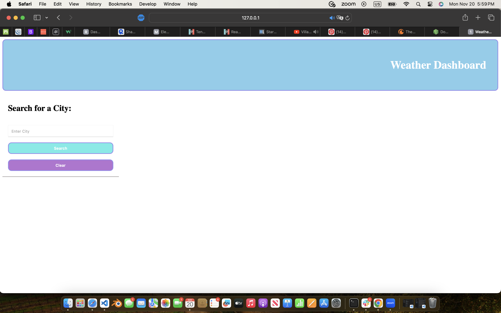

# Weather Forecast API

## Description 
In this repository the user can acces the forecast for the next five days, consecutively. By entering the name of any city within the text field, and then clicking the "search" button, the results will pull up a list with the weather of the current date, and four days following after. That data will be saved into the local storage until the user clears the the names of the searched cities with the "clear" button. Once clicking on the clear button, the name of the cities listed below the search field, will delete from both the local storage and the page. 

The following buttons the user can click on are 
>* "Search"
>* "Clear"

To access the weather forecast  click the following link.
[this page](https://utero93.github.io/JS-Quiz-Build/)

Weather Forecast webpage browser setup

## Installation
Navigate to the repository,
>* copy ssh key and git clone plus ssh key in terminal
>* in terminal enter "code ." and if programmed already, the text editor of your choice should open with the files from the repo inside.
>* open the HTML page in the text editor and right click on the tab to open in either a "default/live" browser.
>* from there follow the prompts and enjoy creating random passwords.
>* other way to install is by downloading zip files into users desktop or specified folder for downloads.  

## Usage 
Once you have opened the HTML file in the browser
>* Enter the name of a city
>* Upon clicking search, a list of the current days forecast the next four days after will pull data from the weather api's server and onto the page.
>* Once you have the forecast appear, the user can search for an alternate cities forecast and the previous city will remain listed under the search bar
>* Once the user has finished searchinf for the weather forecast, they can clear the list in order to regenerate more up to date weather data for the forecast of that same city in their new search

## Credits 
N/A
